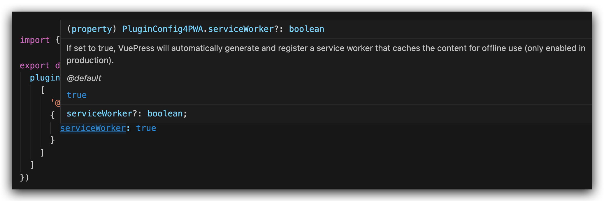
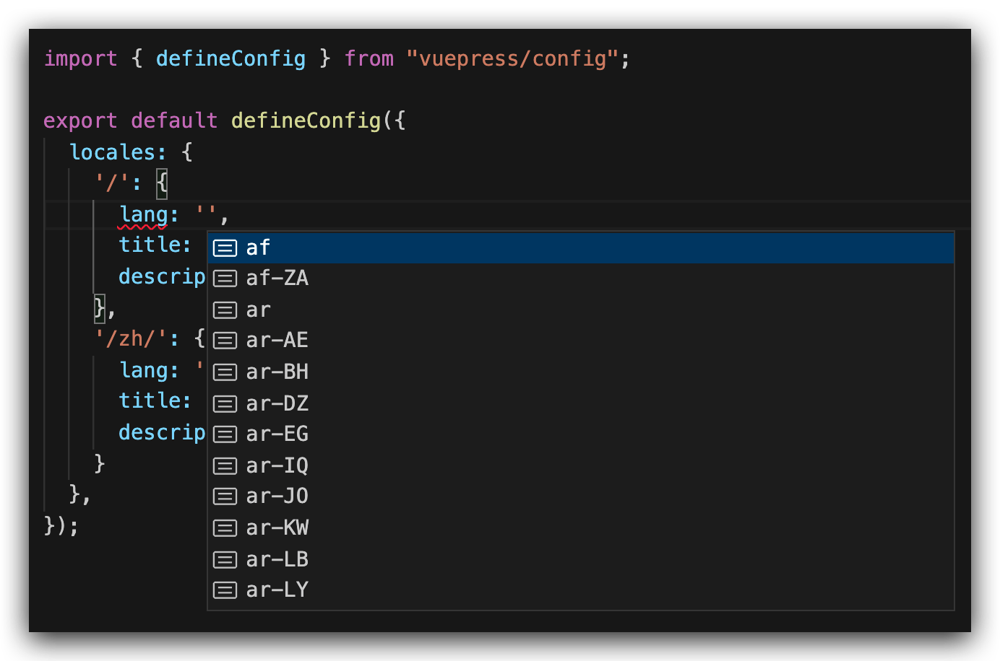

# TypeScript Support for Config file

## Overview


## Features

### Support `.vuepress/config.ts`

Previously, VuePress only supported these configurations

- `.vuepress/config.js`
- `.vuepress/config.yml`
- `.vuepress/config.toml`

From now on, `.vuepress/config.ts` get officially supported.

### `defineConfig` helper for config intellisense

A helper function exposed at `vuepress/config`, which helps you to have type prompt:

```ts
import { defineConfig } from "vuepress/config";

export default defineConfig({
  title: "VuePress",
  description: "Vue-powered Static Site Generator"
  // ...
});
```

### `Typed` Theme Config

By default, `defineConfig` helper leverages the theme config type from default theme:

```js
import { defineConfig } from "vuepress/config";

export default defineConfig({
  themeConfig: {
    repo: "vuejs/vuepress",
    editLinks: true,
    docsDir: "packages/docs/docs"
    // Type is `DefaultThemeConfig`
  }
});
```

If you use a custom theme, you can use the `defineConfig4CustomTheme` helper with ability to pass generic type for your theme:

```ts
import { defineConfig4CustomTheme } from "vuepress/config";

interface MyThemeConfig {
  hello: string;
}

export default defineConfig4CustomTheme<MyThemeConfig>(
  {
    themeConfig: {
      // Type is `MyThemeConfig`
      hello: "vuepress"
    }
  },
```

### Type Inferences for Official Plugins

From now, you’ll be able to enjoy the type prompt of the official plugins:


Options of the official plugins certainly have type prompts, **Both [Tuple Style](https://vuepress.vuejs.org/plugin/using-a-plugin.html#plugin-options) and [Object Style](https://vuepress.vuejs.org/plugin/using-a-plugin.html#plugin-options), and [Plugin Shorthand](https://vuepress.vuejs.org/plugin/using-a-plugin.html#plugin-shorthand) support type inference**:

- Tuple Style:



```ts
import { defineConfig } from 'vuepress/config'

export default defineConfig({
  plugins: [
    [
      '@vuepress/pwa',
      {
        serviceWorker: true
      }
    ]
  ]
})
```

- Object Style:

```ts
import { defineConfig } from 'vuepress/config'

export default defineConfig({
  plugins: {
    '@vuepress/pwa': {
      serviceWorker: true
    }
  }
})
```

The illustration snapshot is omitted here, you can try it yourself.


### ISO Language Code

Type inference supports [ISO Language Code](http://www.lingoes.net/en/translator/langcode.htm)




### Context API

VuePress’s configuration can also be a function, while its first parameter is the current [app context](https://vuepress.vuejs.org/plugin/context-api.html#context-api):

```ts
import { defineConfig } from "vuepress/config";

export default defineConfig(ctx => ({
  // do not execute babel compilation under development
  evergreen: ctx.isProd
}));
```

## Limitations

It is worth noting that third-party plugins do not support [Plugin Shorthand](https://vuepress.vuejs.org/plugin/using-a-plugin.html#plugin-shorthand) if you’re using [Tuple Style](https://vuepress.vuejs.org/plugin/using-a-plugin.html#plugin-options) to write your config, this is because from the perspective of the type system, the unknown shortcut is equivalent to `string`, which results in the failure of type inference.

By default, only officially maintained and plugins under [VuePress Community](https://vuepress-community.netlify.app/en/) support shortcut, feel free to submit pull request to add your plugin at this [file](https://github.com/vuejs/vuepress/blob/master/packages/vuepress/types/third-party-plugins.ts).


## Credits

- [bundle-require](https://github.com/egoist/bundle-require) (by [@egoist](https://github.com/egoist)): we leverage it under the hood to resolve user's config, which is powered by `esbuild`.
- [vscode-ts-in-markdown](https://github.com/Amour1688/vscode-ts-in-markdown) (by [@Amour1688](https://github.com/Amour1688)): this documentation is powered by this plugin, which make type checking possible in markdown.
